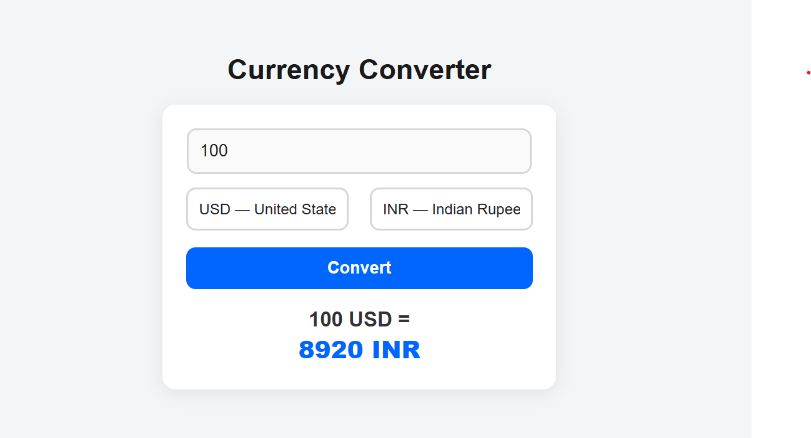

<div align="center">

# 💱 Currency Converter  
### **Flask-Based Web Application with Live Exchange Rates (REST API)**  
A modern, responsive, and production-quality currency conversion application.

<br>



<br><br>

[]()
[]()
[]()
[]()

</div>

---

# 📘 **Project Overview**

This project is a **fully functional Currency Converter Web Application** built using:

- **Flask (Python)** for backend routing and API handling  
- **Frankfurter REST API** for accurate, real-time currency exchange data  
- **HTML, CSS, JavaScript** for a clean, responsive user interface  

The UI follows a **professional fintech design language**, using a minimal and elegant theme of **black, white, gray, and blue**, ensuring a seamless and modern user experience.

---

# 🎯 **Key Features**

### 🔹 **Real-Time Currency Conversion**  
Integrates directly with the Frankfurter API to fetch the latest exchange rates.

### 🔹 **Elegant & Modern UI**  
Clean, minimal interface designed with professional fintech color standards.

### 🔹 **Responsive Frontend**  
Optimized for desktops, tablets, and smartphones.

### 🔹 **Dropdown Autoload via REST API**  
Currency list loads dynamically at page load.

### 🔹 **Fast and Lightweight**  
No database required, uses live API calls.

### 🔹 **Error Handling Built-In**  
Gracefully handles invalid amounts, missing inputs, and same-currency conversions.

---

# 🛠️ **Tech Stack**

### **Frontend**
- HTML5  
- CSS3  
- Vanilla JavaScript (Fetch API)

### **Backend**
- Python 3.x  
- Flask micro-framework  
- Requests library  

### **API**
- 📡 **Frankfurter Exchange API**  
  Provides accurate, updated foreign exchange rates.

---

# 📂 **Project Structure**

```

currency-converter/
│
├── app.py
├── requirements.txt
│
├── templates/
│   └── index.html
│
└── static/
├── style.css
└── script.js

````

---

# ⚙️ **Setup Instructions**

### **1. Clone the Repository**
```bash
git clone https://github.com/your-username/currency-converter.git
cd currency-converter
````

### **2. Install Dependencies**

```bash
pip install -r requirements.txt
```

### **3. Launch the Application**

```bash
python app.py
```

### **4. Access the Web App**

Open the browser and navigate to:

```
http://127.0.0.1:5000
```

---

# 🖥️ **User Interface Preview**

Add your screenshot here (replace the path):

```markdown

```

---

# 🔍 **How It Works**

### **1. Load Currencies via API**

JavaScript fetches available currency codes:

```javascript
fetch("https://api.frankfurter.app/currencies")
```

### **2. User Inputs Amount and Currency Pair**

### **3. Conversion API Call**

```javascript
https://api.frankfurter.app/latest?amount=100&from=USD&to=INR
```

### **4. Flask Handles Backend Routing**

### **5. Result Displayed in Real-Time**

Clean output shown with highlighted conversion value.

---

# 📡 **Sample API Response**

```json
{
  "amount": 100,
  "base": "USD",
  "date": "2024-02-01",
  "rates": {
    "INR": 8312.50
  }
}
```

---

# 🚀 **Future Enhancements (Roadmap)**

* 🔄 Swap currency button (USD ⇄ INR)
* 🌓 Dark / Light mode toggle
* 🚩 Country flags in dropdown
* 📊 Currency conversion trend chart (Chart.js)
* 🗂 Conversion history storage (LocalStorage / DB)
* 🔁 Auto-convert on typing
* 🎨 Theming options (Fintech Blue, Midnight Black, Luxury Gold)

---

# 📄 **License**

This project is open-source and free to use under the MIT License.

---

# 👨‍💻 **Author**

### **Arham Shaikh**

Computer Engineering Student | Python Developer | Full-Stack Enthusiast

If you found this project useful, consider giving the repository a ⭐ on GitHub!

---

<div align="center">

### **Developed with precision, clean design, and modern web standards.**

</div>
```

